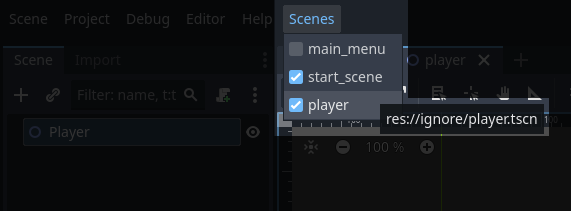

# Favorite Scenes
`v2.0`

Adds a `Scenes` dropdown for quickly loading & selecting scenes.

To add a scene to favorites:

- Open the scene in editor.
- Select `Scenes\Current scene...`.
- Select a group.

To remove a scene:

- Open the scene in editor.
- Select `Scenes\Current scene...\Remove from favorites`

If it doesn't show up, either open `favorite_scenes.gd` and hit save, or reload the project.

# Changes
- v2.1
	- Fixed list not updating on first open scene.
- v2.0
	- Node name & class icon are used in drop down.
	- Assign scenes to groups.
	- Not tied to built in Favorites. `res://.godot/.favorite_scenes.json`
